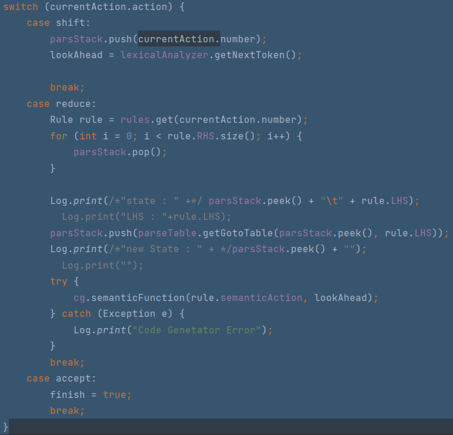
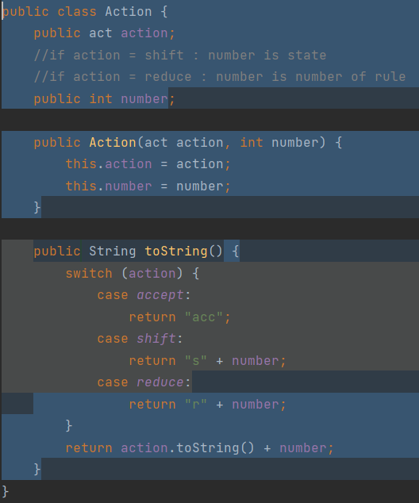
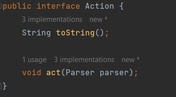
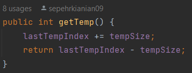
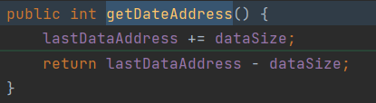
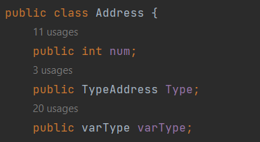
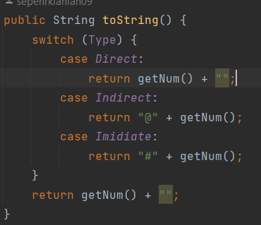

## انجام آزمایش
ابتدا برای آنکه بتوانیم در حین انجام بازآرایی از درست کار کردن کد مطمئن شویم، یک تابع تست به پروژه اضافه می‌کنیم. این تابع را در کلاس‌های Memory, CodeGenerator پیاده‌سازی می‌کنیم، و در ابتدا فقط در آخر کلاس Parser به‌جای چاپ خروجی، تست‌کردن را انجام می‌دهیم. جزئیات عمل انجام‌شده را می‌توانید در کامیت `test: add test feature for CodeGenerator` مشاهده کنید.

### اعمال الگوی Facade
#### اعمال اول
با مشاهده‌ی کلاس Main می‌بینید عملیات مختلف Compile بسیار بهم مرتبط و درهم تنیده هستند. از این جهت لایه‌های مختلف، اعم از LexicalAnalyzer, Parser, etc. را از هم جدا کردیم و با یک CompilerFacade این‌ها را بهم مرتبط کردیم.

### استفاده از Polymorphism به‌جای شرط
یکی از موارد اعمال این عمل بازآرایی، برای کلاس Action بود. در شکل زیر کدی را می‌بینید که براساس نوع Action یک عمل را انجام می‌دهد. 

همانطور که در شکل زیر مشاهده می‌کنید، متغیر number در انواع Shift و Reduce‌ تعبیری جدا دارد، و در Accept‌هم اصلا بلا استفاده است. همچنین تابع toString هم از شرط استفاده کرد.

نتیجتا، این کلاس را به واسط زیر تبدیل کرده و انواع آن را جداگانه پیاده‌سازی می‌کنیم.

### Separate Query from Modifier
یکی از مواردی از این مسئله که در کد مشاهده کردیم، در کلاس Memory است که در شکل زیر نمایان شده است. همانطور که مشاهده می‌کنید، متغیر درون کلاسی lastTempIndex در این تابع به‌ظاهر از نوع Query تغییر می‌کند. برای انجام بازآرایی، این عمل تغییر را در یک تابع دیگر و از نوع Modifier انجام می‌دهیم.

در همان فضای اعمال بازآرایی پیشین، تابع getDateAddress نیز همان مشکل را داشت، که آن را بازآرایی کردیم. می‌توانید تابع را در زیر مشاهده کنید.

### سایر بازآرایی‌ها

#### Self Encapsulated Field
در کلاس Address سه متغیر وجود دارد که هر سه از نوع public هستند. برای اعمال بازیابی، این متغیرها را از نوع private می‌کنیم و یک getter برایشان قرار می‌دهیم.

#### استفاده از Polymorphism به‌جای شرط
کلاس Address در خود یک متغیر به نام Type نگه می‌دارد که نوع آن را مشخص می‌کند. در شکل زیر می‌بینید رفتار این کلاس براساس Type مشخص می‌شود.

برای اعمال بازآرایی، به‌ازای هرنوع از Type یک subclass‌ تعریف کرده و رفتار را در آن تنظیم می‌کنیم.

#### اعمال الگوی Singleton
کلاس Log یک کلاسی‌ست که فقط عملیات انجام می‌دهد و توابع درون آن static است. برای بالابردن انعطاف این کلاس، آن را به یک کلاس Singleton تبدیل کردیم.

یک کلاس IOUtils هم در پکیج Utils تعریف کردیم، که باتوجه به نوع کلاس، آن را هم Singleton تعریف کردیم.

## پرسش‌ها

### سوال ۱
* کد تمیز به کد شفاف، قابل درک، و همینطور قابل maintain می‌گویند.
* بدهی فنی عموما به عواقب اولویت بخشیدن به سریع تحویل دادن محصول نسبت به تحویل محصول کامل و بازآرایی شده اشاره می‌کند.
* بوی بد به نشانه‌ها و یا ویژگی‌هایی در کد و ساختار آن اشاره می‌کند که خود این ویژگی نشان‌دهنده‌ی نقض اصول برنامه‌نویسی بزرگتری است.

### سوال ۲
دسته‌ی bloater یا نفاخ: این دسته، مربوط به توابع و یا کلاس‌هایی می‌شود که آنقدر بزرگ شده‌اند که کار کردن با آن‌ها بسیار سخت شده است. این کلاس‌ها عموما به مرور زمان بزرگ و بزرگ‌تر هم می‌شوند.

دسته‌ی object-orientation abuser‌ یا سوءاستفاده کننده از شیءگرایی: این دسته مربوط به کدهایی‌ست که استفاده‌ی نادرست یا ناقض از مفاهیم و اصول شیءگرایی می‌کنند. از مثال معروف آن‌ها می‌توان به Refused Bequest یا میراث رد شده اشاره کرد.

دسته‌ی جلوگیری کننده از تغییر یا change Preventers: این دسته مربوط به کدهایی است که تغییر در آن‌ها بسیار سخت است. عموما به این خاطر است که عوض کردن یک قسمت از کد قسمت‌های بسیاری را درگیر می‌کند. از مثال معروف آن‌ها می‌توان به shotgun surgery اشاره کرد.

دسته‌ی غیر ضروری‌ها یا dispensables: این دسته به مواردی از کد که بی‌هدف و بی‌استفاده هستند اشاره می‌کند، که با حذف آن‌ها کد ساده‌تر و کوچکتر می‌شود. از موارد معروف آن‌ها می‌توان به کدهای تکراری یا duplicate و کامنت‌ها اشاره کرد.

دسته‌ی جفت‌کننده‌ها یا couplers: این دسته به جفت‌شدگی بیش‌از حد بین کلاس‌ها اشاره می‌کند. این دسته به موارد اعمال delegation بی‌رویه هم اشاره می‌کند. از موارد معروف این دسته Message Chain و Feature Envy است. 

### سوال ۳
این کد در دسته‌ی غیرضروری‌ها یا dispensables قرار می‌گیرد.

عموما در شرایط مختلف از بازآرایی‌های [Inline Class](https://refactoring.guru/inline-class) یا [Collapse Hierarchy](https://refactoring.guru/collapse-hierarchy) برای برطرف کردن این بوی بد استفاده می‌شود.

در مواقعی که آن lazy class مسیر کارهای آینده را ترسیم می‌کند، باید آن را نادیده گرفت. در واقع، برای مدیریت درست این بوی بد، حواسمان به تعادل بین شفافیت و سادگی کد باشد.